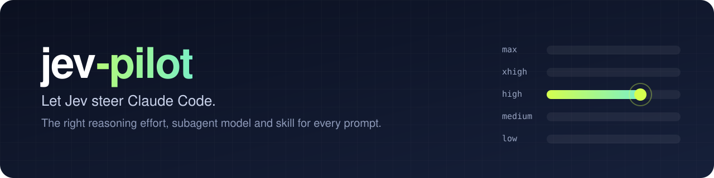
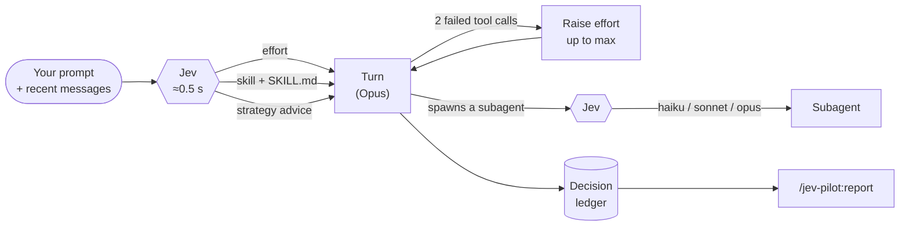

<p align="center">
  
</p>

<p align="center">
  <a href="https://github.com/Akramovic1/jev-pilot/actions/workflows/test.yml"></a>
  <a href="LICENSE"></a>
  <a href="https://docs.claude.com/en/docs/claude-code"></a>
  <a href="https://typesafe.ai/blog/introducing-system-one-models-and-jev"></a>
  <a href="https://openrouter.ai/~typesafe/jev-latest"></a>
</p>

<p align="center">
  <b>The right reasoning effort, subagent model and skill for every prompt, decided by a model built for decisions.</b>
</p>

<p align="center">
  <a href="#-install">Install</a> ·
  <a href="#-how-it-works">How it works</a> ·
  <a href="#%EF%B8%8F-meet-the-pilot">The pet</a> ·
  <a href="#-see-if-its-paying-off">Report</a> ·
  <a href="#%EF%B8%8F-configuration">Configuration</a> ·
  <a href="#-acknowledgements">Acknowledgements</a>
</p>

---

**jev-pilot** is a Claude Code plugin. Before every turn, it asks [Jev](https://typesafe.ai/blog/introducing-system-one-models-and-jev), TypeSafe's fast decision model, a few typed questions about your prompt and sets the turn up from the answers. You keep Opus for the conversation. Easy work runs at low effort and on cheaper subagents, and hard work gets the thinking it needs.

| | Decision | When |
|---|---|---|
| 🧠 | **Reasoning effort**, `low` → `xhigh` | at the start of each turn |
| 🚨 | **Raise effort, up to `max`**, when tool calls keep failing | mid-turn, at most once |
| 🤖 | **Subagent model and effort**: Haiku, Sonnet or Opus, `low` → `xhigh` | when a subagent starts |
| 🧭 | **Strategy**: do it directly, delegate, run in parallel, or plan a graph | at the start of each turn, as advice |
| 🧩 | **The one skill** the prompt needs, if any | at the start of each turn |
| 📊 | **A record of every decision**, with tuning suggestions | always, via `/jev-pilot:report` |

Jev never writes in your conversation. It talks through **Claude the pilot**, a small animated pet above the prompt that shows what Claude is doing and says what Jev decided.

<p align="center">
  
  <br>
  <sub>An illustrative session: the pet and its bubbles are drawn from the plugin's own code; the numbers are examples.</sub>
</p>

> [!NOTE]
> jev-pilot runs on Claude Code's **function hooks**, which are early access: they need Claude Code **2.1.278 or newer** and `CLAUDE_CODE_ENABLE_FUNCTION_HOOKS=1`. The `claude-jev` launcher sets that for you.

## 🚀 Install

```sh
curl -fsSL https://raw.githubusercontent.com/Akramovic1/jev-pilot/main/install.sh | bash
```

It asks for your OpenRouter key ([create one here](https://openrouter.ai/keys); Jev costs about $0.04 per million input tokens, with free output), installs jev-pilot as a regular Claude Code plugin, and adds the `claude-jev` command. Then start Claude Code with it:

```sh
claude-jev          # takes the same arguments as claude: claude-jev -c, claude-jev -p "…"
```

<details>
<summary><b>What the installer does</b></summary>

<br>

1. Checks that Claude Code is installed and new enough.
2. Adds this repo as a Claude Code plugin marketplace and runs `claude plugin install jev-pilot@jev-pilot`. The key is passed with `--config`, so Claude Code keeps it in its own credential store, not in plain settings.
3. Links `claude-jev` into `~/.local/bin`. It's plain `claude` with function hooks on.

It changes nothing else. Re-running it updates jev-pilot and keeps your key. For scripted installs, set `JEV_OPENROUTER_KEY=sk-or-…` (or `JEV_SKIP_KEY=1`) to skip the prompt.

</details>

<details>
<summary><b>Install by hand, with Claude Code's own commands</b></summary>

<br>

```sh
claude plugin marketplace add Akramovic1/jev-pilot
claude plugin install jev-pilot@jev-pilot --config openrouterApiKey=sk-or-v1-… --config timeoutMs=1500
CLAUDE_CODE_ENABLE_FUNCTION_HOOKS=1 claude
```

To skip typing the variable, put it in `~/.claude/settings.json` and plain `claude` will do:

```json
{ "env": { "CLAUDE_CODE_ENABLE_FUNCTION_HOOKS": "1" } }
```

</details>

<details>
<summary><b>From a clone, for development</b></summary>

<br>

```sh
git clone https://github.com/Akramovic1/jev-pilot.git && cd jev-pilot
./install.sh
```

This loads the clone with `--plugin-dir`, so your edits take effect in the next session. Options go in `~/.claude/settings.json` under `pluginConfigs["jev-pilot"]`, and the installer adds your key there after a backup. `claude-jev` checks your clone's upstream once a day in the background and tells you when there's something new.

</details>

### Check it's working

Start `claude-jev` and look above the prompt, at the right: the pilot appears with a bubble saying `ready · openrouter`. After your first prompt the bubble says what Jev decided, such as `low · no skill · 99% sure`.

If it says `ready · no key, built-in`, the key isn't being read. Run the installer again. To see every step Jev takes, turn on `verboseLog` (see [Configuration](#%EF%B8%8F-configuration)).

### Update and uninstall

```sh
claude-jev self-update                                            # update jev-pilot, whichever way it was installed
curl -fsSL https://raw.githubusercontent.com/Akramovic1/jev-pilot/main/install.sh | bash -s -- --uninstall
```

> [!IMPORTANT]
> If you ran `/jev-pilot:setup`, run `/jev-pilot:setup restore` before uninstalling. Otherwise your skills stay hidden from Claude with nothing left to load them.

## 🧠 How it works



**Effort.** Jev rates each request on a five-level rubric. Each level describes a kind of task, not an amount:

| Level | Kind of task |
|---|---|
| `low` | answered from what's known, or one mechanical step: a lookup, one command, a rename |
| `medium` | an ordinary, well-specified change to a few files, or a direct question about code in view |
| `high` | a change across several files, a described bug that must be traced, tests, a careful review |
| `xhigh` | design across components, a bug with an unknown cause, a refactor with many dependents |
| `max` | novel architecture, security or data integrity, a failure that resisted earlier attempts |

- **Close calls lean up, as far as `high`.** If Jev's two most likely levels are within `effortCloseMargin` (0.15), the higher one wins, because under-thinking costs more than over-thinking.
- **Above `high`, Jev has to be sure.** `xhigh` needs Jev at least 60% sure the task is very hard (`xhigh` and `max` together). A near split between hard and very hard stays at `high`.
- **Raising and lowering have different bars.** Raising effort needs confidence of 0.3 or more; lowering it needs 0.6.
- **Risky work gets real thought.** If carrying the task out would itself deploy, move money or destroy data, effort goes to at least `high`.
- **Turns start at `xhigh` at most** (`maxEffort`). Only the mid-turn raise reaches `max`: after `escalateAfterErrors` (2) failed tool calls in a row, effort goes up at least one level, once per turn. Permission denials don't count as failures.

**What Jev reads.**
- Your prompt.
- The last 4 messages, capped at 2000 characters: text and tool names only, never tool input or output. So "yes, do it" is judged as the work it agrees to.
- Plain facts about the request: its length, how many files it names, whether it contains code or an error, whether it's a question, and what recent turns did with their tools.

**Subagents.** Each one gets the cheapest tier that can do its brief well: `haiku`, `sonnet` or `opus`. These are family names, so Claude Code uses its current release of each. No versions are hardcoded. It also gets an effort from the same decision, on the same rubric and bars as the main conversation, but Jev is asked how hard the brief is to *carry out*: a brief that already names the files, steps and tests has done the design, so builders and fixers usually get `high`, and `xhigh` is kept for briefs that ask for design or an unknown cause. The Agent tool has no effort setting, so jev-pilot sets it on each request the subagent makes.

**Claude knows it's there.** On the first prompt of each session (and after a compaction), Claude gets a short note listing what jev-pilot decides, so it leaves those decisions alone: it won't pin a subagent's model or effort, or make agent types just to fix one, unless you ask.

**Strategy.** The same request asks how to carry the work out:
- **`direct`**: the usual case, and nothing is attached.
- **`delegate`**: one subagent on a cheaper model does the broad, mechanical part.
- **`parallel`**: independent pieces run as simultaneous subagents.
- **`graph`**: small dependency waves of subagents, with integration and tests between waves.

Advice is attached only when Jev is confident (0.6, or 0.8 for `graph`) and it agrees with the tier. Claude may ignore it.

**Skills.** At most one per prompt, picked in two steps:
1. Rank every skill by its description. Catalogs over the API's 255-choice limit are ranked in parallel batches.
2. Re-read the top three with their `SKILL.md`; each can be rejected.

The winner's `SKILL.md` is added to the prompt. `/jev-pilot:setup` can hide your own skills from Claude's skill list entirely (it asks first; `restore` undoes it).

## 🛩️ Meet the pilot

<p align="center">
  
</p>

Claude the pilot, drawn as Claude Code's character, sits above the prompt at the right and shows what Claude is doing:

| Claude is… | The pilot | Its bubble |
|---|---|---|
| thinking | a thought cloud, `...` filling in | `⠋ thinking · …` |
| reading files or pages | an open book, the line being read lit up | `⠋ reading · …` |
| searching (Grep, Glob, web) | a magnifying glass, sweeping | `⠋ searching · …` |
| editing files or writing the answer | paper, a pencil writing lines | `⠋ writing · …` |
| running commands | a terminal, output scrolling | `⠋ running · …` |
| running subagents or other tools | flying: goggles down, jets on | `⠋ working · …` |
| idle | hovering and blinking; every few seconds it jumps rope, waves or looks around | Jev's last decision |

**The bubble** says the turn's effort, the skill attached (or `no skill`), any strategy advice, and **how sure Jev was of the effort**: `xhigh · /systematic-debugging · parallel · 88% sure`. When Jev wanted a change but wasn't sure enough to make it, it says so: `high kept · wanted low · 42% sure`. A mid-turn raise shows as `2 fails → max ✈`, and a subagent's model as `Explore → haiku`.

It draws only in the terminal (not in `claude -p`, the desktop app or mobile), and redraws only while something moves. `/jev pet off` hides it.

### Switch any part on or off

Everything is on by default except switching the main conversation's model. Type `/jev` to see the switches, and change them live:

```
/jev                    what is on
/jev skills off         one switch: effort · raise · subagents · skills · strategy · model · pet
/jev all off            every switch (all on turns them back on)
/jev reset              back to your settings' defaults
```

Switches are remembered across sessions. `/jev skills off` leaves skills exactly as Claude Code handles them.

### How sure is Jev?

- **The bubble:** the `N% sure` at the end, for each turn.
- **A line per turn in the conversation:** set `display` to `both` or `transcript`, and each turn gets one line, such as `jev · low (93% sure) · no skill · 1.3s`.
- **Every raw score:** turn on `verboseLog` to see each answer with its confidence, such as `tier fast (0.99) · effort 0.0 → low (1.00) · risky 0.10 · strategy direct (1.00)` and `needs a skill 0.09`.

## 📊 See if it's paying off

Every main-conversation turn is recorded: what Jev answered, the effort the turn started at, whether it was raised, tool calls, failures, how it ended, and output tokens. **No prompt text is ever stored.** After a few days, run `/jev-pilot:report` in a session:

```
Decision ledger: 142 turns since 2026-09-23.

Jev answered 97% of turns; latency median 540 ms, 90th percentile 910 ms.

| Started at | Turns | Raised mid-turn | Avg tool calls | Avg output tokens |
|---|---|---|---|---|
| low    | 61 | 3%  | 1.4  | 310  |
| medium | 38 | 8%  | 4.2  | 1180 |
| xhigh  | 29 | 17% | 11.6 | 5400 |
```
<sub>Illustrative output: the format is exact, the numbers are made up.</sub>

After 20 or more turns, it suggests specific changes, such as a longer `timeoutMs` if answers arrive late, or leaning up more if cheap starts keep getting raised. It asks before editing anything. `/jev-pilot:report reset` clears the record.

## ⚙️ Configuration

Every option has a sensible default. On a marketplace install, change options with `/plugin configure jev-pilot@jev-pilot` in Claude Code. On a clone install, edit `pluginConfigs["jev-pilot"].options` in `~/.claude/settings.json`. The on/off options are also switches you can flip live with [`/jev`](#switch-any-part-on-or-off).

<details>
<summary><b>Most-used options</b></summary>

<br>

| Option | Default | What it does |
|---|---|---|
| `openrouterApiKey` / `typesafeApiKey` / `gatewayApiKey` | — | the backend key |
| `timeoutMs` | 800 (installer sets 1500) | how long to wait for Jev before leaving a turn as Claude Code built it |
| `maxEffort` | `xhigh` | the highest effort a turn may start at |
| `maxRaisedEffort` | `max` | the highest effort the mid-turn raise may reach |
| `escalateAfterErrors` | 2 | failed tool calls in a row before a raise; 0 turns raising off |
| `effortCloseMargin` | 0.15 | how close two levels must be for the higher to win |
| `fastModel` / `balancedModel` / `deepModel` | `haiku` / `sonnet` / `opus` | subagent tiers: family names or full ids |
| `routeSubagentEffort` | true | also set each subagent's reasoning effort |
| `routeMainModel` | false | also switch the main conversation's model (invalidates the prompt cache); if Claude Code falls back to another model mid-turn (overload), the fallback stands |
| `suggestStrategy` | true | ask for and attach strategy advice |
| `graphSkill` | — | a heavier orchestration skill the `graph` advice may mention |
| `contextMessages` / `contextChars` | 4 / 2000 | how much of the conversation Jev reads; 0 sends none |
| `recordDecisions` | true | keep the decision record for `/jev-pilot:report` |
| `display` | `pet` | where jev-pilot talks: `pet`, `transcript` (one line per turn), `both`, or `off` |
| `verboseLog` | false | log every step: each answer with its confidence, the skill ranking, and why a turn was left alone |
| `suggestSkills` | true | pick one skill per prompt; off leaves skills as Claude Code handles them |
| `logDecisions` | true | master switch for jev-pilot's messages in the conversation (errors always show) |

All options are listed, with descriptions, in [`.claude-plugin/plugin.json`](.claude-plugin/plugin.json).

</details>

<details>
<summary><b>Backends</b></summary>

<br>

| `provider` | Key option | Endpoint | Default model | Confidence |
|---|---|---|---|---|
| `typesafe` | `typesafeApiKey` | `POST api.typesafe.ai/v1/systemone` | `jev-latest` | calibrated |
| `openrouter` | `openrouterApiKey` | `POST openrouter.ai/api/v1/systemone` | `~typesafe/jev-latest` | calibrated |
| `gateway` | `gatewayApiKey` | `POST ai-gateway.vercel.sh/v4/ai/evaluation-model` | `typesafe-ai/jev` | only from an optional distribution |
| `builtin` | none | Claude Code's built-in classifier | n/a | none: tier only |

- **`auto`** (the default) uses the first backend in that order whose key is set.
- **Forced backends don't borrow keys.** A forced `provider` without its own key falls back to `builtin`; it never uses another backend's key.
- **To pin a Jev version,** set `openrouterModel` to e.g. `typesafe/jev-1.13`.

</details>

## 🔒 Cost, latency and privacy

- **Latency:** each prompt waits for up to three small Jev requests: effort and strategy, then the skill ranking and its re-check. That's typically about 1.5 s in total, and each request is capped at `timeoutMs`. If Jev doesn't answer in time, the turn runs exactly as Claude Code built it.
- **Cost:** Jev requests are small. The largest is the skill ranking, which sends every skill's description.
- **What leaves your machine** goes only to the backend you chose:
  - the prompt;
  - the recent messages' text and tool names;
  - skill names and descriptions, and the opening of the shortlisted `SKILL.md` files.

  Tool input and output are never sent. `contextMessages: 0` sends no conversation.

## ⚖️ What it will and won't do

jev-pilot is a fast classifier in front of Claude, not a second brain. It sees your prompt and a few recent messages, never your code. At best, it matches effort and model to the task and supplies the right skill. It can still misjudge a hard task that reads as simple. The confidence bars, the lean toward more effort and the mid-turn raise limit the damage, and the report shows you how often it happens. Measure it on your own work before you rely on it.

## 🛠️ Development

```sh
bun test                                                   # unit tests of the decision logic   (tests/*.spec.ts)
CLAUDE_CODE_ENABLE_FUNCTION_HOOKS=1 claude plugin test .   # hooks in Claude Code's own engine  (engine/*.test.ts)
claude plugin validate .claude-plugin/plugin.json          # manifest and hook-registration rules
```

<details>
<summary><b>Repository layout</b></summary>

<br>

```
.claude-plugin/plugin.json        manifest and options
.claude-plugin/marketplace.json   makes the repo installable with `claude plugin install`
install.sh                        the installer
bin/claude-jev                    launcher and self-update
hooks/jev-pilot.ts                the one hooks module: registers the rest
hooks/jev-model-router.ts         effort, subagent model, strategy, mid-turn raise, ledger
hooks/model-router.policy.ts        its pure decision logic
hooks/jev-skill-suggestion.ts     skill listing and the one-skill pick
hooks/skill-suggestion.policy.ts    its pure decision logic
hooks/context.ts                  what Jev reads of the conversation, and the request's signals
hooks/ledger.ts                   the decision record, the report and its suggestions
hooks/jev-pet.tsx                 the pet above the prompt, and the /jev command
hooks/pet-art.ts                  the pilot's pixel art: every pose, prop and frame, and the bubble's text
hooks/features.ts                 the switches /jev flips
hooks/summary.ts                  the one line per turn, for display transcript/both
commands/                         /jev-pilot:setup, /jev-pilot:report
docs/                             the original modules' documentation
assets/                           banner, demo and pet (animated SVG, CSS only), social preview card
scripts/assets/                   generate them: banner.py, demo.py, pet.py, social.py; the pet is
                                  drawn from hooks/pet-art.ts (frames.ts, petsvg.py)
```

The engine tests load the plugin without options, so they cover the keyless path. The keyed path is covered by the unit tests, and was checked live against OpenRouter.

</details>

<details>
<summary><b>Releasing an update</b></summary>

<br>

Marketplace installs update by version number, so every release needs a version bump:

1. Bump `version` in **both** `.claude-plugin/plugin.json` and `.claude-plugin/marketplace.json` (CI checks they agree), and add a `CHANGELOG.md` entry.
2. Commit, then run `claude plugin tag .` to tag the release (`jev-pilot--v<version>`).
3. Run `git push && git push --tags`.

Users then get it with `claude-jev self-update`, `claude plugin update jev-pilot@jev-pilot`, or by running the installer again. Clone installs update with `git pull` (or `claude-jev self-update`) and don't need a version bump.

</details>

## 🙏 Acknowledgements

jev-pilot is built on two open-source Claude Code mods by **Daniel (San) Ávila**, from [claude-code-templates](https://github.com/davila7/claude-code-templates) (MIT):

- **Jev Model Router**: [aitmpl.com](https://aitmpl.com/component/mod/productivity/jev-model-router) · [source](https://github.com/davila7/claude-code-templates/tree/main/cli-tool/components/mods/productivity/jev-model-router)
- **Jev Skill Suggestion**: [aitmpl.com](https://aitmpl.com/component/mod/productivity/jev-skill-suggestion) · [source](https://github.com/davila7/claude-code-templates/tree/main/cli-tool/components/mods/productivity/jev-skill-suggestion)

Their routing policy, the two-step skill suggestion and the setup command come from those mods, and their original docs are kept in [`docs/`](docs/). jev-pilot merges them into one plugin and adds:
- the OpenRouter backend;
- the effort rubric up to `max`, with the close-call lean and the mid-turn raise;
- strategy advice;
- recent context and request signals;
- the decision ledger and report;
- batched skill ranking;
- the pet and the `/jev` switches;
- the installer and `claude-jev`.

Decisions are made by [**Jev**](https://typesafe.ai/blog/introducing-system-one-models-and-jev), [TypeSafe](https://typesafe.ai)'s System One model. The pilot in the banner and the pet is fan art of Claude Code's character. Claude and Claude Code are trademarks of Anthropic. jev-pilot is a community project, not affiliated with TypeSafe or Anthropic.

## 📄 License

[MIT](LICENSE). Portions are copyright Daniel (San) Ávila, from claude-code-templates.
